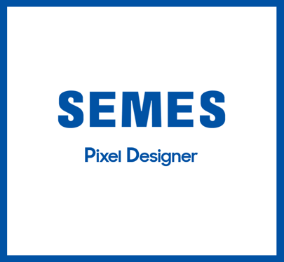

# SPD(SEMES Pixel Design): 셀 단위 픽셀 패턴 디자인

반도체 장비기업 SEMES와 진행한 기업 연계 프로젝트.

디스플레이 생산에 필요한 패턴화 된 셀 제작 UI 툴입니다.

- **디스플레이 생산 과정**
  - process1
  - process2
  - process3

img here

## 주요기능

## 세부기능
|구분|기능|설명|비고|
|:---|:---|:---|:---|
|1|픽셀 패턴 기반 셀 관리| | | |
|2|장비와 소켓 통신| | | |
|3|| | | |
## 아키텍처

## 설치
- system.ini 파일 default_path(기준 폴더), 클라이언트 정보 입력(ip, port)
- exe 파일 실행
## 사용 예시

## 릴리즈 히스토리

## 라이센스
