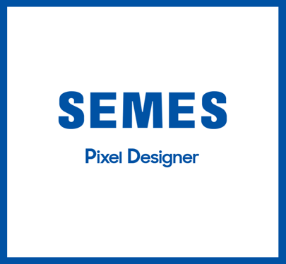
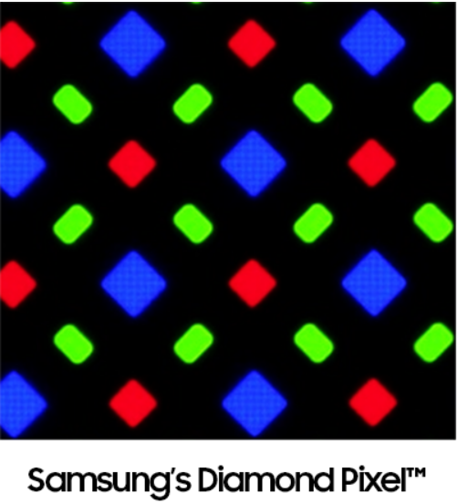
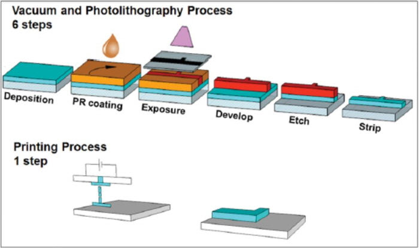
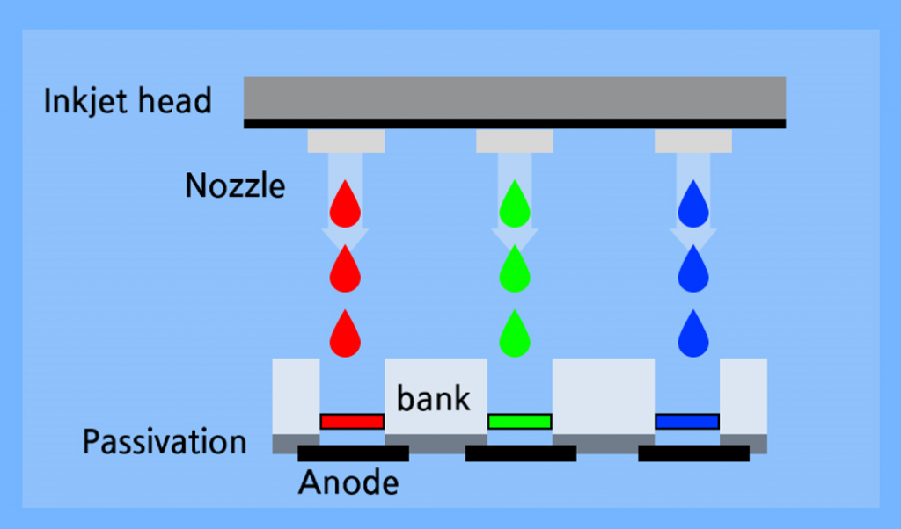

# SPD(SEMES Pixel Design): 셀 단위 픽셀 패턴 디자인

반도체 장비기업 SEMES와 진행한 기업 연계 프로젝트.

디스플레이 생산에 필요한 패턴화 된 셀 제작 UI 툴입니다.

- **디스플레이 생산 과정**
  - process1
  - process2
  - process3

출처 : https://news.samsungdisplay.com/32664
      https://blog.naver.com/ckbc6101/221085068781

## 주요기능

## 세부기능
|구분|기능|설명|비고|
|:---|:---|:---|:---|
|1|픽셀 패턴 기반 셀 관리|한 글라스 내의 **여러 셀 정보**를 확인할 수 있고, 셀 별 폴리곤 패턴 편집 가능| |
|2|텍스트, 그래픽 동시 편집 기능|폴리곤 편집을 **그래픽 상으로 편집**이 가능하며 **텍스트로 정밀한 편집**이 가능| |
|3|장비와 소켓 통신|장비에서 생산을 위한 최신 패턴 정보 파일을 요청하면 **최신 파일 경로를 전달**| |
|4|dxf 파일 확장자|CAD 파일에서도 실행하여 확인할 수 있는 **확장자 지원**| |
## 아키텍처

### 1. 픽셀 패턴 기반 셀 관리

 

### 2. 텍스트, 그래픽 편집

 

### 3. 소켓 통신

 

### 4. 사용성

## 설치
- system.ini 파일 default_path(기준 폴더), 클라이언트 정보 입력(ip, port)
- .exe 파일 실행

## 사용 예시

## 릴리즈 히스토리
* Work in progress

## 라이센스
