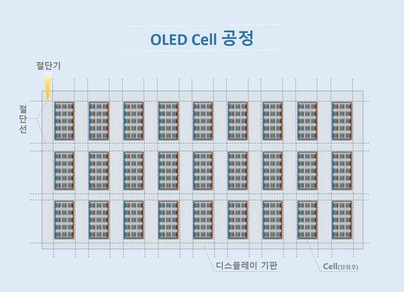
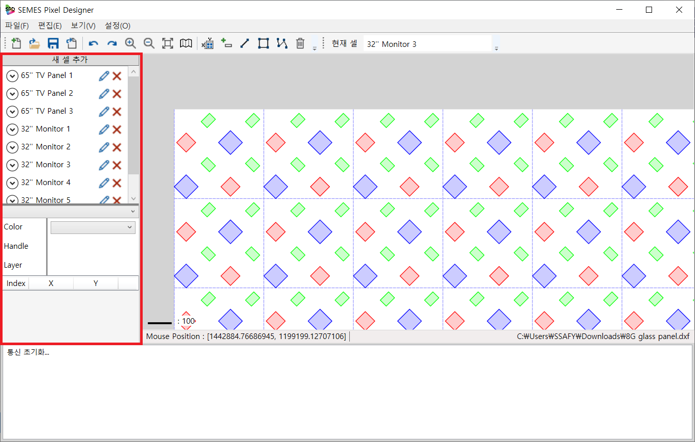
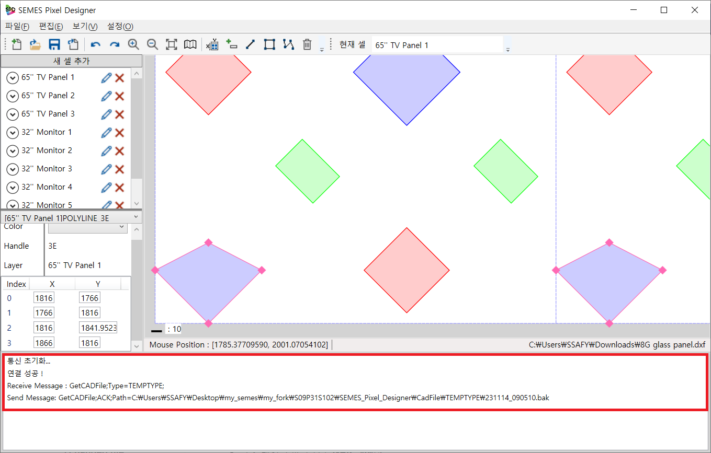

# SPD(SEMES Pixel Design): 셀 단위 픽셀 패턴 디자인

반도체 장비기업 SEMES와 진행한 기업 연계 프로젝트.

디스플레이 생산에 필요한 패턴화 된 셀 제작 UI 툴입니다.

- **SPD가 필요한 이유**
  - 삼성이 개발한 Diamond Pixel은 기존의 텍스트 기반으로 polygon 데이터를 만드는 것은 직관적이지 않음. => UI 툴 필요
  - UI 기능 제공과 동시에 color, polygon 데이터 까지 관리하여 통신하여 생산 공정에 바로 적용되도록 효율성 증대
  - 라이센스 절감 비용 및 생산 비용 절감 효과 (30% 절감 예상)
**`* 보안 문제로 실제 픽셀 데이터 제공은 불가.`**  

 

- 기존 공정 대비 **공정 수 대폭 절감**할 수 있는 잉크젯 프린팅 기법

- 픽셀에 잉크 투입 방법

출처 : https://news.samsungdisplay.com/
      https://blog.naver.com/ckbc6101/221085068781

## 주요기능
- 글라스 기반 셀 생성 및 편집, 패턴 생성 및 편집
- 텍스트 기반 세밀한 변경
- 생성된 글라스 데이터 소켓 통신

## 세부기능
|구분|기능|설명|비고|
|:---|:---|:---|:---|
|1|픽셀 패턴 기반 셀 관리|한 글라스 내의 **여러 셀 정보**를 확인할 수 있고, 셀 별 폴리곤 패턴 편집 가능| |
|2|텍스트, 그래픽 동시 편집 기능|폴리곤 편집을 **그래픽 상으로 편집**이 가능하며 **텍스트로 정밀한 편집**이 가능| |
|3|장비와 소켓 통신|장비에서 생산을 위한 최신 패턴 정보 파일을 요청하면 **최신 파일 경로를 전달**| |
|4|dxf 파일 확장자|CAD 파일에서도 실행하여 확인할 수 있는 **확장자 지원**| |

## 기능 상세

### 1. 픽셀 패턴 기반 셀 관리
- 공정에서 아래 사진과 같이 한 글라스 내 **패턴 기반으로 그려진 여러 셀**이 존재

 

- **셀 단위로 패턴 제작이 가능**하며 여러 셀로 관리됨 (셀 범위 밖에서 패턴 생성 불가)
 

①	기존의 dxf 파일을 불러와 각 셀에 패턴 확인. (미니맵을 통해 셀 정보 확인 가능, 셀 내의 패턴 확인 가능)
②	셀 범위 내의 패턴 제작이 가능.

 

### 2. 텍스트, 그래픽 편집
- 텍스트 기반 **새 셀 제작** 페이지

①	새 셀 추가 버튼 클릭.
②	셀 정보 입력 후 추가 버튼 클릭.

- **셀 정보**, **폴리곤 정보** 페이지

①	각 셀의 polygon 데이터를 visible, invisible 처리 가능
②	polygon 선택 후 RGB 색상 변경 가능

- **텍스트 기반**, **그래픽 기반** 폴리곤 편집 가능

①	패턴 내 polygon 선택 후 각 꼭지점의 좌표 확인 가능
②	꼭지점을 마우스로 선택하여 polygon 모양 변경 가능
③	polygon 선택 후 꼭지점 좌표(index) 정보 text로 변경 가능

 

### 3. 소켓 통신
- 타겟 데이터 경로 있을 시 **ACK 메세지**

- 타겟 데이터 없을 경우 **NAK 메세지**

①	프로그램 실행시 항상 연결 대기 상태
②	클라이언트(장비)측에서 연결 요청 수신시 연결 성공 메세지
③	수신된 파일 경로의 최신 픽셀 데이터 요청시 폴더 존재 여부 확인
④	존재할 시 ACK 메세지 + 경로 전송, 없을 시 NAK 메세지 전송

 

### 4. 사용성
- dxf 파일 확장자로 관리 => CAD 파일에서도 사용 가능

## 설치
- system.ini 파일에 default_path(기준 폴더), 클라이언트 정보 입력(ip, port), DEFAULT_PATTERN_SIZE(확대 기준) 입력
- .exe 파일 실행

## 사용 예시

①	글라스내 셀 새로 제작 시

 

②	기존 파일 편집 시

## 릴리즈 히스토리
* Work in progress

## 라이센스
