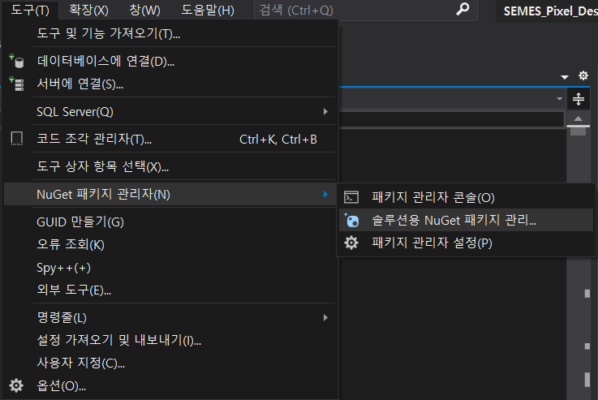
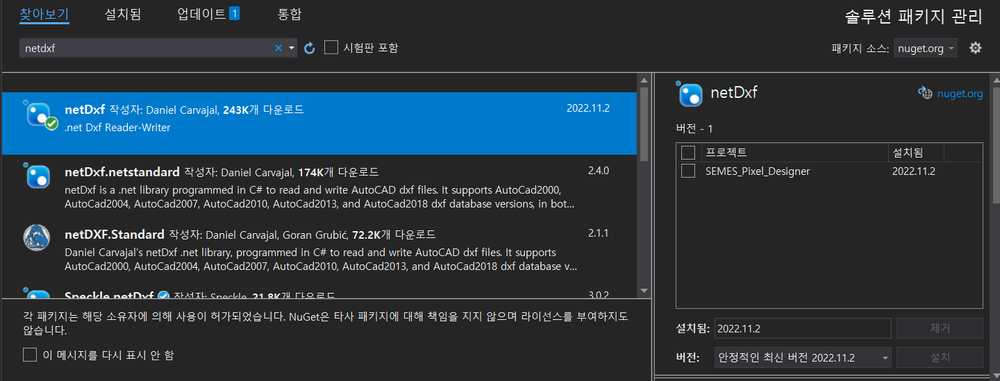

# 포팅 가이드(Porting Guide)

## install tool

- download [VS 2019](https://my.visualstudio.com/Downloads?q=visual%20studio%202019&wt.mc_id=o~msft~vscom~older-downloads)
- install C# .NET framwork 4.8
- install netdxf on nuget (MIT LICENSE)



## Clone to Run

```bash
git clone https://lab.ssafy.com/s09-final/S09P31S102.git
```

